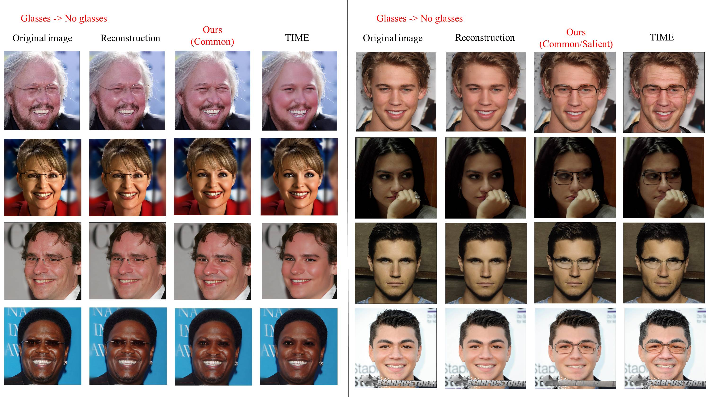
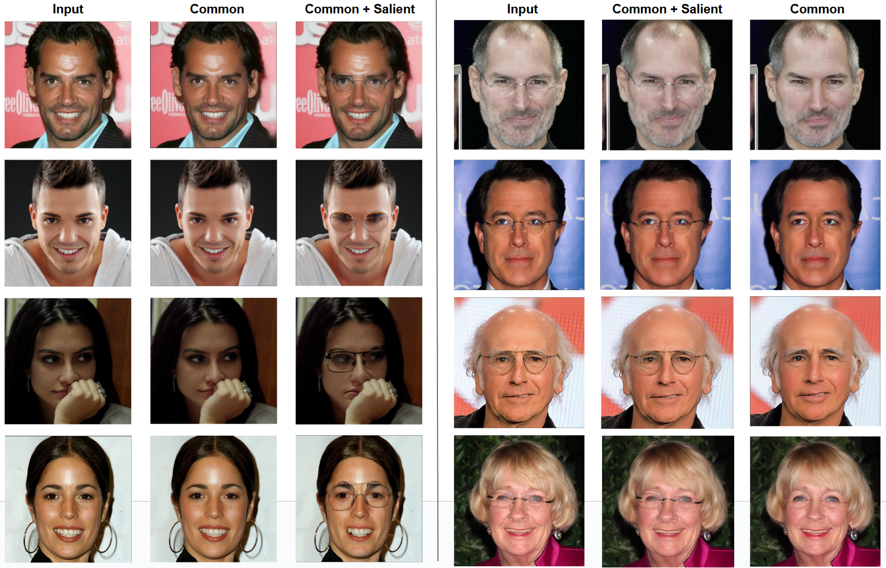

# Contrastive Analysis for Unsupervised Image Editing in Stable Diffusion

This project extends the idea of [TIME (Counterfactual Analysis)](https://github.com/guillaumejs2403/TIME) by proposing an improved **Contrastive Analysis (CA) framework**.
Our approach explicitly disentangles **context**, **common**, and **salient** factors between two domains, enabling more interpretable **attribute disentanglement and editing** in Stable Diffusion — **without relying on classifiers** during training or inference.

If you are interested in the work, please check out the [**Project Report**](Research_project_2.pdf), which contains detailed workflows and experimental results.  

---

## 📌 Background & Motivation
Counterfactual (CF) approaches often learn embeddings that **mix both shared and domain-specific information**, making it difficult to interpret which factors truly drive the generation.

In contrast, our framework introduces three types of embeddings:
- **Context** – dataset-level biases (lighting, scene composition)
- **Common** – class-agnostic features shared across domains (e.g., facial structure)
- **Salient** – domain-specific cues that distinguish one class from another (e.g., eyeglasses)

By separating these components, the learned embeddings gain clearer semantics, making attribute editing more interpretable and controllable — and crucially, the method **does not require a classifier at inference time**.

Additionally, in our unsupervised setup, we train pseudo-word embeddings using **`"unknown"`** as the prompt token across datasets, and achieve results qualitatively consistent with the original TIME approach.

---

## 📝 References & Acknowledgements
Our method is inspired by the idea proposed in:
- [Text-to-Image Models for Counterfactual Explanations: a Black-Box Approach](https://arxiv.org/abs/2309.07944)

⭐️ Feel free to star this repo and reach out with any issues or suggestions!
